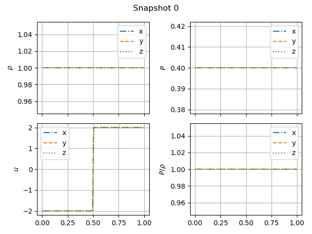

# The Einfeld-1203 strong rarefaction test

In [Einfeldt et al. (1991)](https://www.sciencedirect.com/science/article/pii/0021999191902113), a set of problems designed to test hydrodynamics Riemann solvers are described. 

We will compare the Bifrost and Ramses solvers with figure 11 in [Stone et al.](https://iopscience.iop.org/article/10.1086/588755/pdf) in order to verify the performance of our solvers. 

Starting with the Bifrost solver, we are using using $$\gamma = 1.4$$, and setting the end time to $$t=0.1$$ s. 

INLINE TEST: 
Starting with the Bifrost solver, we are using using \\($$\gamma = 1.4$$)\\, and setting the end time to $$t=0.1$$ s. 

For the Einfeldt-1203 test, the initial right and left values are as follows: 

|            	| $$\rho$$ 	| $$v_x$$ 	| $$v_y$$ 	| $$v_z$$ 	| $$P$$ 	| $$B_x$$ 	| $$B_z$$ 	|
|------------	|----------	|---------	|---------	|---------	|-------	|---------	|---------	|
| Left side  	| 1.0      	| -2.0    	| 0       	| 0       	| 0.4   	| ...     	| ...     	|
| Right side 	| 1.0      	| 2.0     	| 0       	| 0       	| 0.4   	| ...     	| ...     	|

The Einfeldt test in the x-, y- and z-directions simulated by the Bifrost solver, gives the result: 

Comparing our plot with figure 11 in [Stone et al.](https://iopscien    ce.iop.org/article/10.1086/588755/pdf), we can immediately see that the x-axis has different values. This should have no effect on the shape of the plots, and we therefore choose not to bother with changing the x-axis to replicate the figure. We also see that the shape of the specific internal energy ($$P/\rho$$) is different from the reference figure. XXX 

We can examine the time evolution of the einfeldt problem by plotting a specific snapshot. The biggest changes happen in the earliest snapshots, since the system begins in an extreme initial state. The following gif shows how the system changes from snapshots 0 (the initial state) to snapshot 5.

Further on, we can modify each of the Bifrost parameters $$\nu_1$$, $$\nu_2$$, $$\nu_3$$, $$\nu_d$$, $$\nu_ee$$ and $$\eta_3$$. 
