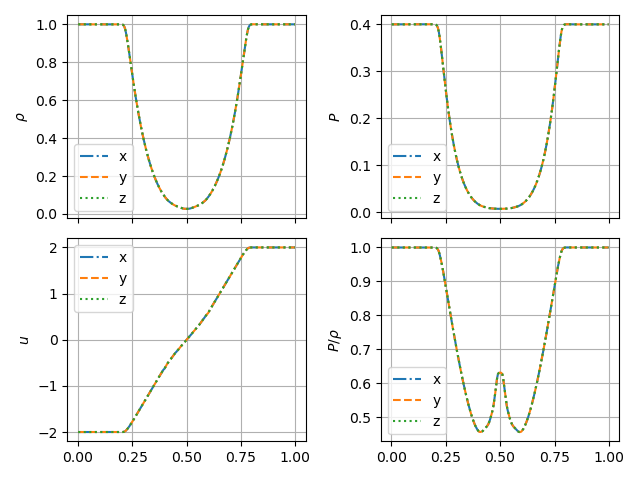

# The Einfeld-1203 strong rarefaction test

In [Einfeldt et al. (1991)](https://www.sciencedirect.com/science/article/pii/0021999191902113), a set of problems designed to test hydrodynamics Riemann solvers are described. 

For the Einfeldt-1203 test, the initial right and left values are as follows: 

|            	| $$\rho$$ 	| $$v_x$$ 	| $$v_y$$ 	| $$v_z$$ 	| $$P$$ 	| $$B_x$$ 	| $$B_z$$ 	|
|------------	|----------	|---------	|---------	|---------	|-------	|---------	|---------	|
| Left side  	| 1.0      	| -2.0    	| 0       	| 0       	| 0.4   	| ...     	| ...     	|
| Right side 	| 1.0      	| 2.0     	| 0       	| 0       	| 0.4   	| ...     	| ...     	|

The Einfeldt test in the x-, y- and z-directions as simulated by the Bifrost solver, gives the result: 

