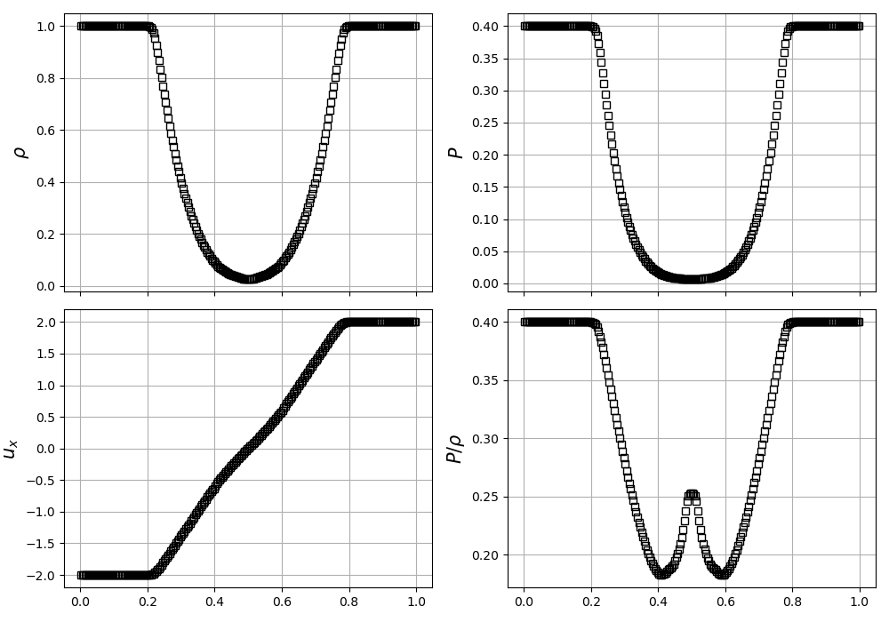
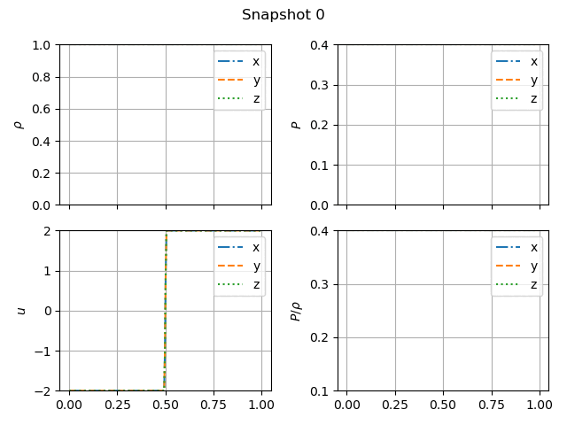
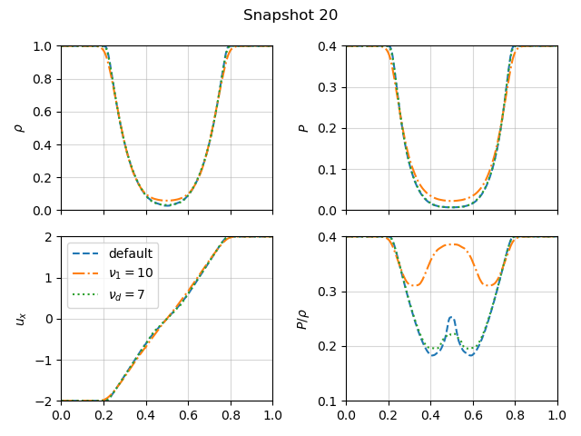
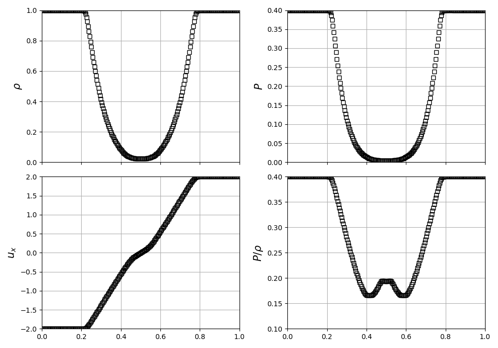
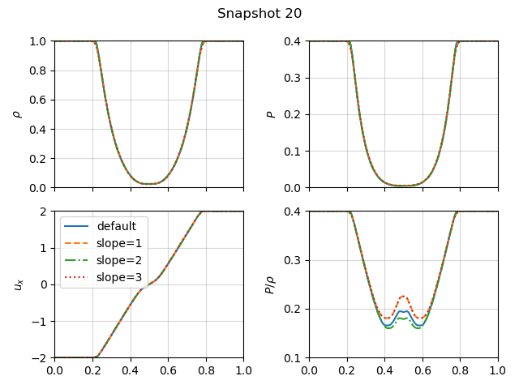

# The Einfeld-1203 strong rarefaction test

In [Einfeldt et al. (1991)](https://www.sciencedirect.com/science/article/pii/0021999191902113), a set of problems designed to test hydrodynamics Riemann solvers are described, and among them is the Einfeldt-1203 test. 
We will compare the quantities we get from the Bifrost and Ramses solvers with figure 11 in [Stone et al.](https://iopscience.iop.org/article/10.1086/588755/pdf) in order to verify the performance of our solvers. 

As described in [Stone et al.](https://iopscience.iop.org/article/10.1086/588755/pdf), the initial right and left values are as follows: 

|            	| $\rho$ 	| $v_x$ 	| $v_y$ 	| $v_z$ 	| $P$ 	| $B_x$ 	| $B_z$ 	|
|------------	|----------	|---------	|---------	|---------	|-------	|---------	|---------	|
| Left side  	| 1.0      	| -2.0    	| 0       	| 0       	| 0.4   	| ...     	| ...     	|
| Right side 	| 1.0      	| 2.0     	| 0       	| 0       	| 0.4   	| ...     	| ...     	|

In other words, the Einfeldt-1203 test consists of separating the domain with an imaginary membrane, and having the horizontal velocity be negative on one side and positive on the other side. We will then observe how the other parameters change when the imaginary membrane is yanked away, creating a shockwave that propagates through the domain.

### Bifrost with stagger2

We begin with the Bifrost solver, using using $\gamma = 1.4$, and simulating until $t=0.1$ s. 
Plotting the final density $\rho$, pressure $P$, horizontal velocity $u_x$ and $P/\rho$ (the specific internal energy scaled by ($\gamma - 1$)) in the x-direction yields figure 1: 

Comparing our plot with figure 11 in [Stone et al.](https://iopscience.iop.org/article/10.1086/588755/pdf), we can immediately see that the x-axis has different values. This should have no effect on the shape of the plots, and we therefore choose not to bother with changing the x-axis to replicate the figure. We also see that the shape of the specific internal energy ($P/\rho$) is different from the reference figure, and that it does not extend down quite as far as it should. 
The reason for this might be that we are plotting the wrong variable, or that it is somehow scaled differently in the paper. 
(We plot the specific internal energy as: `p/rho`, where ``p = rho * (gamma - 1) * ee`. )
However, the pressure and density plots seem to fit the reference figure very nicely, and therefore we assume the results are valid, and we choose to only look at the density, pressure and velocity plots when fine-tuning the Bifrost parameters. 

We can examine the time evolution of the einfeldt problem by plotting a specific snapshot. The biggest changes happen in the earliest snapshots, since the system begins in an extreme initial state, which it will very quickly try to even out. 
The following gif shows how the system changes from snapshots 0 (the initial state) to snapshot 20 (the end time $t=0.1$ s.

Further on, we can modify each of the Bifrost parameters $\nu_1$, $\nu_2$, $\nu_3$, $\nu_d$, $\nu_{ee}$ and $\eta_3$ in order to fine-tune the solver to better match the results in [Stone et al.](https://iopscience.iop.org/article/10.1086/588755/pdf) 
I found that changing the Bifrost parameters one by one did little in terms of the density and pressure plots. The biggest changes are seen in the plot of the specific internal energy $P/\rho$.

The initial parameters are as follows: 

| Parameter 	| $\nu_1$ 	| $\nu_2$ 	| $\nu_3$ 	| $\nu_d$ 	| $\nu_{ee}$ 	| $\eta_3$ 	|
|-----------	|---------	|---------	|---------	|---------	|------------	|----------	|
| Value     	| 0.01    	| 0.3     	| 0.1     	| 0.05    	| 0.5        	| 0.3      	|

We can visualise what changing the parameters does by plotting the default solution in the x-direction along wih a few altered solutions. Plotting at $t=0.1$ s for $\nu_1 = 10$, and for $\nu_d=7$ yields: 

Not focusing too much on the specific internal energy, as mentioned above, we can see that the "bump" in horizontal velocity gets softened out more when we increase the value of $\nu_1$. 
As we increase $\nu_d$, there is little change, but it may appear that the "bump" also gets a little softened, thus straying further from the reference solution in [Stone et al.](https://iopscience.iop.org/article/10.1086/588755/pdf)

### Compiling with the Ramses HLLD solver

Using the Ramses solver with the default settings yields the following figure:

We can see immediately that the velocity plot much more closely resembles the reference plot in [Stone et al.](https://iopscience.iop.org/article/10.1086/588755/pdf), clearly showing the "bump" in the horizontal velocity around the center of the plot.  

In order to fine-tune the Ramses solver, we can vary the `slope` parameter, which is initially set to be `slope=3.5`. Setting this parameter to be $1$, $2$, and $3$, we can plot the resulting solutions at $t=0.1$ s:

Here we can see that tuning the `slope` parameter does very little in terms of the overall shape of the graph. 
There is a small difference in the slope of the density pressure plots, at the points where the graph start to drop from $\rho=1.0$ and $P=0.40$ respectively. 
In the solution with `slope=2`, this is visible at the very top of the central curve.
