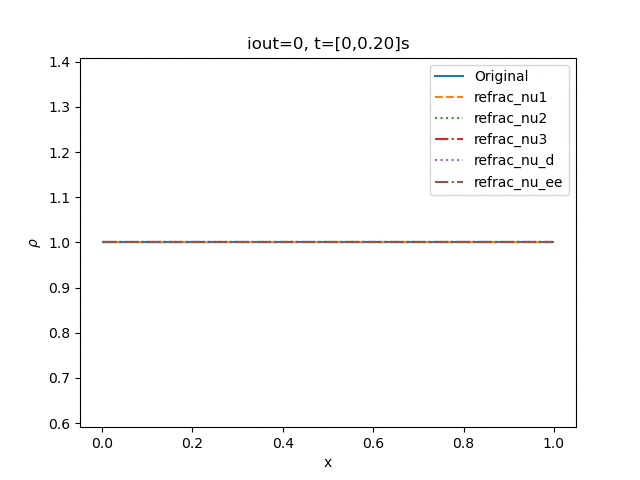
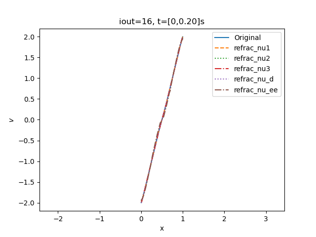

# Fast rarefaction test

* Hash: 177f0c9
* Branch: development-bc

## Bifrost

Using the initial conditions stated in **<++> insert ref here<++>** 

|$$\rho_L$$|$$v_{x,L}$$|$$v_{y,L}$$|$$v_{z,L}$$|$$P_L$$|$$B_{y,L}$$|$$B_{z,L}$$|$$\rho_R$$|$$v_{x,R}$$|$$v_{y,R}$$|$$v_{z,R}$$|$$P_R$$|$$B_{y,R}$$|$$B_{z,R}$$|
|---|---|---|---|---|---|---|---|---|---|---|---|---|---|
|1|-2|0|0|0.45|0.5|0|1|2|0|0|0.45|0.5|0|

I get the following animations 

For the still picture for the same time as the refrence.  

Where we observe that the velocity plot is a bit diffrenent then the figure 5 in (**ADD HERE**) 

Will now tweak the parameteres. 
Here I ran into a problem that for the **eta3** parameter. 
That the whole program would crash for a higher value, so have neglected that for the following. 

Still pictures

## Ramses
The original animation from the ramses are

