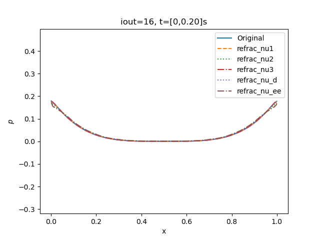

# Fast rarefaction test

* Hash: 177f0c9
* Branch: development-bc

## Bifrost

Using the initial conditions stated in **[(Miniati and Martin, Table 5)](https://arxiv.org/pdf/1103.1878.pdf)** 

|$$\rho_L$$|$$v_{x,L}$$|$$v_{y,L}$$|$$v_{z,L}$$|$$P_L$$|$$B_{y,L}$$|$$B_{z,L}$$|$$\rho_R$$|$$v_{x,R}$$|$$v_{y,R}$$|$$v_{z,R}$$|$$P_R$$|$$B_{y,R}$$|$$B_{z,R}$$|
|---|---|---|---|---|---|---|---|---|---|---|---|---|---|
|1|-2|0|0|0.45|0.5|0|1|2|0|0|0.45|0.5|0|

I get the following animations 

For the still picture for the same time as the refrence.  

Where we observe that the velocity plot is a bit diffrenent then the figure 5 in (Miniati and Martin, 27) 

Will now tweak the parameteres. 
Here I ran into a problem that for the **eta3** parameter. 
That the whole program would crash for a higher value, so have neglected that for the following. 

Still pictures. 

Since I had a problem getting my grid to be the same as (Miniati and Martin). 
Most of the following observation are observation must be taken with a grain of salt. 

But comparing the velocity still figure it seems to beneficial to be tweaking the **nu_ee** bifrost parameter to a higher value to get the exact same plot. 
But this change will make the pressure and density plot to deviate. 

## Ramses
The original animation from the **ramses** solver are

For a slope parameter of one it crashes after one timestep. 
And observe that for a parameter of two it's just vertical. 
And for three it's not even showing.

Had to be tripple check my script to make sure it was plotting over the correct axis. 
But it is plotting over the $x$-axis on all of them and the above animation are the correct one. 
This indicates that the original slope parameter of 3.5 is the best parameter.
