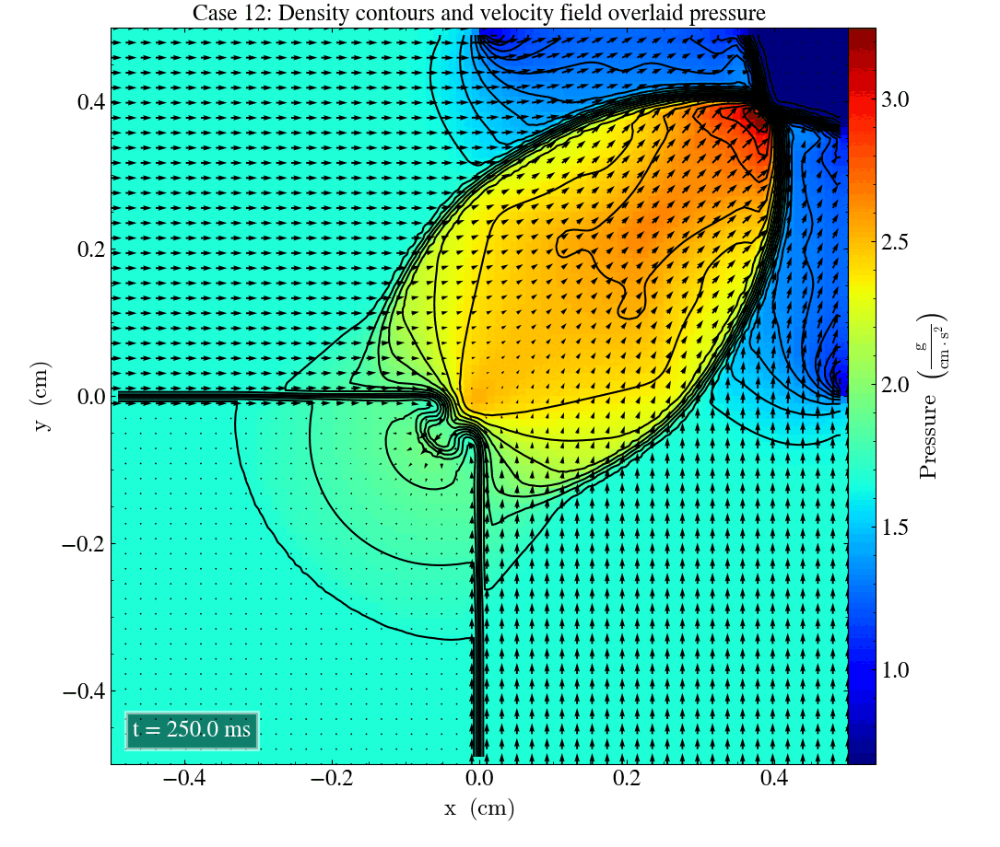
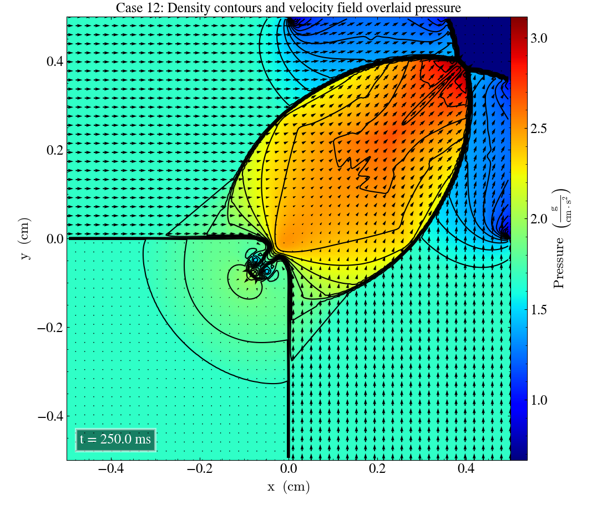
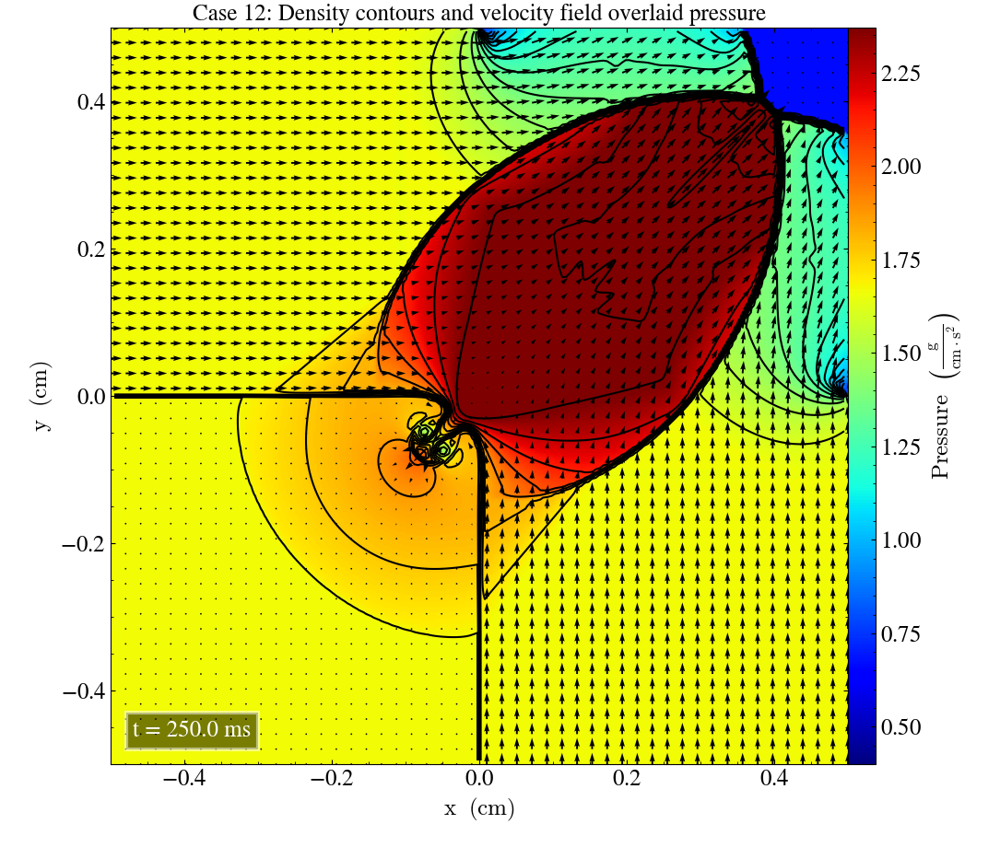

Current branch: develop-bc   
Current commit: 34c177c

# Liska and Wendroff case 12

Case 12 in [Liska and Wendroff (2003)](https://rsaa.anu.edu.au/files/liska_wendroff_2003.pdf) describes a Riemann problem with the intial values: 

|       	| Left  	|          	|           	|           	| Right 	|          	|           	|           	|
|-------	|-------	|----------	|-----------	|-----------	|-------	|----------	|-----------	|-----------	|
|       	| $P_l$ 	| $\rho_l$ 	| $v_{x,l}$ 	| $v_{y,l}$ 	| $P_r$ 	| $\rho_r$ 	| $v_{x,r}$ 	| $v_{y,r}$ 	|
| Upper 	| 1.0   	| 1.0      	| 0.7276    	| 0.0       	| 0.4   	| 0.5313   	| 0.0       	| 0.0       	|
| Lower 	| 1.0   	| 0.8      	| 0.0       	| 0.0       	| 1.0   	| 0.0      	| 0.0       	| 0.7276    	|

We will run this test with the parameters described above, plotting the final time $t=0.25$ s and comparing with the corresponding reference figure in [Liska and Wendroff (2003)](https://rsaa.anu.edu.au/files/liska_wendroff_2003.pdf). 
Since the xy-, yz- and zx-planes produce very similar plots, we have included a gif that shows the plot for each plane. 

We see that the general structure of the solution is similar to the reference figure in Liska and Wendroff, but there are some inaccuracies in the details of the plot. 
As we saw in [case 3](https://eilifso.github.io/sumstud-2022/lw-case3/), the edges of the "shock lines" surrounding the low-pressure region in the top right corner seem to curve near the edges of the grid. 
Again, this may be due to us using different boundary conditions than the ones used in Liska and Wendroff.
It also appears that the high pressure is "leaking" out from the upper right corner, unlike in the reference figure, were the high-pressure area is firmly isolated by the density "shock lines". 

We can produce a plot the xy-plane using a higher resolution in order to more accurately replicate the reference figure. 
Using a $400 \times 400$ grid yields: 

It might be worth noting that the colorbar indicating pressure is a little different from the reference figures. If we plot the data using the same colorbar limits as in Liska and Wendroff, we see that our pressure seems to be consistently higher. 

