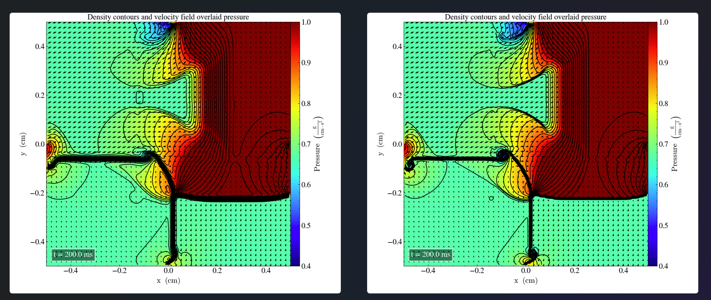
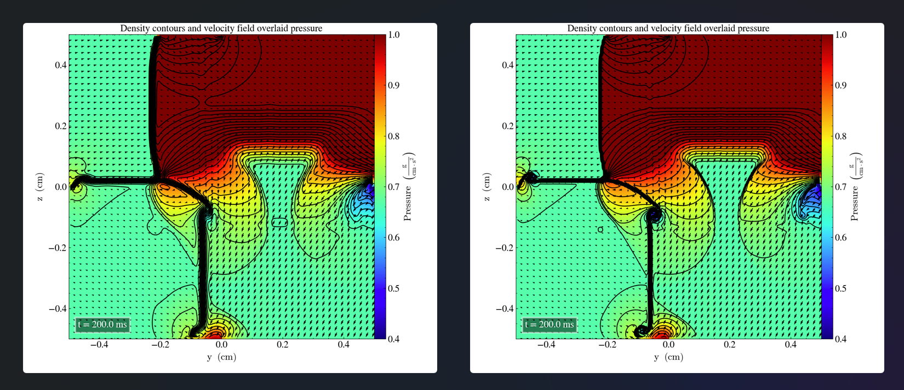
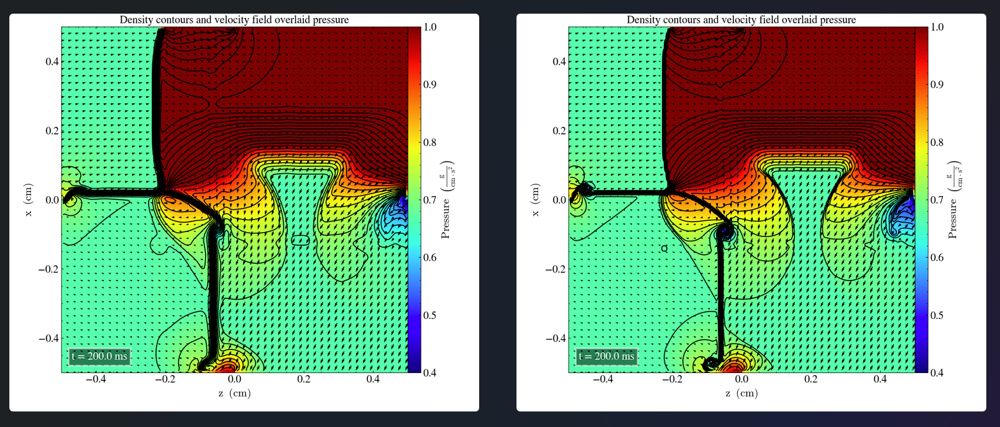

# Liska and Wendroff case 15
Hash 34c177c

We solve the  2D-Riemann problem described in Liska and endroff (2003), case 15 with the following initial parameters:
|       	| $P_l$ 	| $\rho_l$ 	| $v_{x,l}$ 	| $v_{y,l}$ 	| $P_r$ 	| $\rho_r$ 	| $v_{x,r}$ 	| $v_{y,r}$ 	|
|-------	|-------	|----------	|-----------	|-----------	|-------	|----------	|-----------	|-----------	|
| Upper 	| 0.4  	| 0.5197   | -0.6259   	|-0.3      	| 1.0   	| 1.0   	  | 0.1       	| -0.3       	|
| Lower 	| 0.4   	| 0.8     	| 0.1   	| -0.3     	| 0.4   	| 0.5313  	| 0.1       	| 0.4276    	|

The results in the xy-plane, at final time t=2.2s are visualized in low (left) and high (right) resolution.

Pressure is displayed by color and density by 29 contours.

We observe a similar structures when compared to FIG. 4.5 in Liska and Wendorff (2003). Although, there are areas with higher density and pressure across the domain which are not present in Liska and Wendorff (2003), the velocities seem to point in the same directions.  

The process is repeated, using the same initial parameters in the yz-plane, producting the following plots

and the zx-plane

