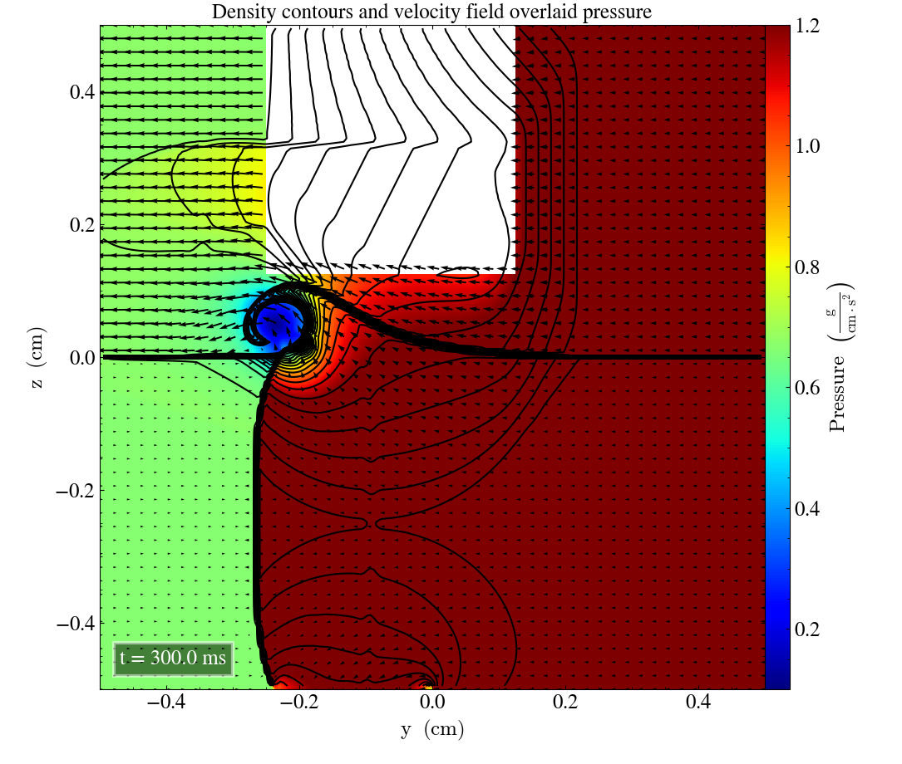

# Liska and Wendroff case 17

* Current branch: develop-bc
* Current commit: 34c177c

## Initial parameters
|       	| Left  	|          	|           	|           	| Right 	|          	|           	|           	|
|-------	|-------	|----------	|-----------	|-----------	|-------	|----------	|-----------	|-----------	|
|       	| $P_l$ 	| $\rho_l$ 	| $v_{x,l}$ 	| $v_{y,l}$ 	| $P_r$ 	| $\rho_r$ 	| $v_{x,r}$ 	| $v_{y,r}$ 	|
| Upper 	| 1.0   	| 2.0      	| 0.0    	| -0.3       	| 1.0   	| 1.0   	| 0.0       	| -0.4       	|
| Lower 	| 0.4   	| 1.0625      	| 0.0       	| 0.2145       	| 0.4   	| 0.5197      	| 0.0       	| -1.1259    	|

 And produces the following end time plots for the end time

 

Which is close to the [Fig 4.6](https://rsaa.anu.edu.au/files/liska_wendroff_2003.pdf)(Liska and Wendroff, 2003), if we look at the corresponding regime.
And is in accordance to the initial parameters, that the density is higher on the top half of the plot.

If we plot for the same but with a 128x128 grid we get the following

Which has the same form as the 400x400 grid, but the spirals are less defines. 

## yz and zx planes

By permutating the cordinates we can reproduce in the $$yz$$ and $$zx$$ planes, and they should look identical. 
They don't. 
The **.nml** files can be found in the corresponding github repo. 
But one must first permutate, then switch the coordinates of the plane one is looking at. 
e.g $$y\leftrightarrow z$$. 
Then we will still get a transposed image, but the general form is there.

 
 

It is also worth to observe that it is a big chunk of the density that is not properly simulated on the second axis. 

