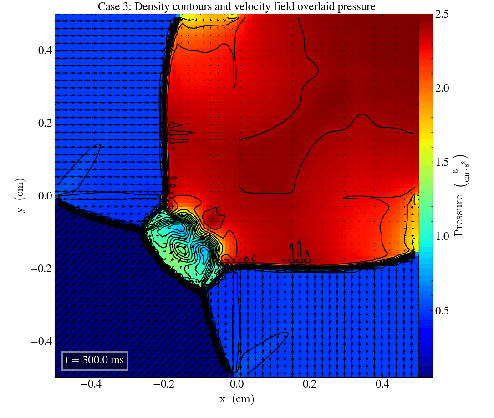
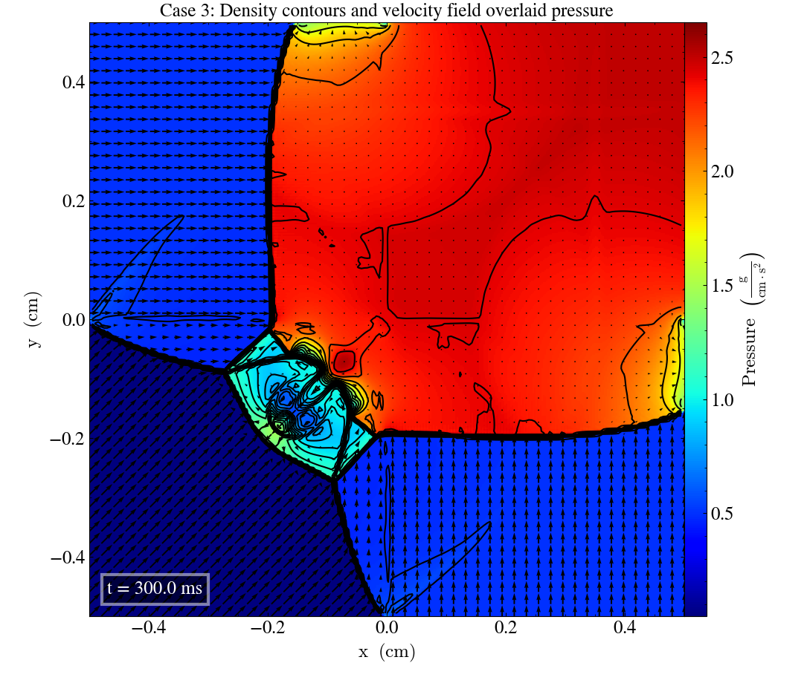

Current branch: develop-bc 

Current commit: XXX

# Liska and Wendroff case 3

In [Liska and Wendroff (2003)](https://rsaa.anu.edu.au/files/liska_wendroff_2003.pdf), a set of 2-dimensional Riemann problems are given. This page looks into case 3, which has the initial parameters: 

|       	| Left  	|          	|           	|           	| Right 	|          	|           	|           	|
|-------	|-------	|----------	|-----------	|-----------	|-------	|----------	|-----------	|-----------	|
|       	| $P_l$ 	| $\rho_l$ 	| $v_{x,l}$ 	| $v_{y,l}$ 	| $P_r$ 	| $\rho_r$ 	| $v_{x,r}$ 	| $v_{y,r}$ 	|
| Upper 	| 0.3   	| 0.5323   	| 1.206     	| 0.0       	| 1.5   	| 1.5      	| 0.0       	| 0.0       	|
| Lower 	| 0.029 	| 0.138    	| 1.206     	| 1.206     	| 0.3   	| 0.5323   	| 0.0       	| 1.206     	|

We will look at snapshots produced by our Ramses HLLD solver, and compare with the reference figures provided in [Liska and Wendroff (2003)](https://rsaa.anu.edu.au/files/liska_wendroff_2003.pdf) at a final time $t=0.25$ s.

We ran the simulation in the xy-, yz- and zx-planes, which after some confusion about the transposing of the axes yielded three nearly identical plots, as shown in the .gif-file below: 

We can immediately see that our plot looks quite different than the reference figures, with the most noticeable difference being that the "shock lines" separating the four quadrants with constant values are curved in our plots, and straight in the reference figure. 
This deformation of the solution might be a result of different boundary conditions. 

### Simulating with higher grid resolution

As this simulation only uses $96 \times 96$ grid points, we will have to simulate on a grid with $400 \times 400$ resolution in order to more accurately reproduce the reference figure. 
(This takes a while to run, so we will only look at the xy-plane from now on.)
Simulating for $400 \times 400$ grid points gives us this plot: 

