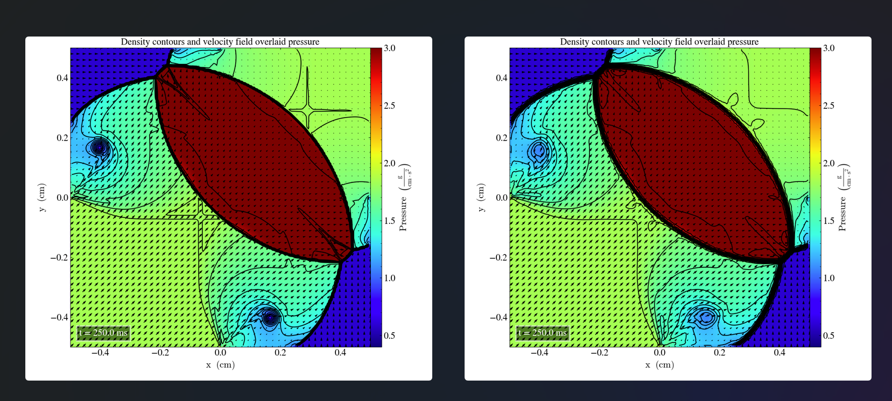

# Liska and Wendroff case 4
Hash 34c177c

We solve the  2D-Riemann problem described in Liska and endroff (2003), case 4 with the following initial parameters:
|       	| $P_l$ 	| $\rho_l$ 	| $v_{x,l}$ 	| $v_{y,l}$ 	| $P_r$ 	| $\rho_r$ 	| $v_{x,r}$ 	| $v_{y,r}$ 	|
|-------	|-------	|----------	|-----------	|-----------	|-------	|----------	|-----------	|-----------	|
| Upper 	| 0.35  	| 0.5065    | 0.8939   	| 0.0       	| 1.1   	| 1.1   	  | 0.0       	| 0.0       	|
| Lower 	| 1.1   	| 1.1     	| 0.8939   	| 0.8939     	| 0.35   	| 0.5065  	| 0.0       	| 0.8939    	|

The results in the xy-plane, at final time t=2.25s are visualized in low (left) and high (right) resolution.

