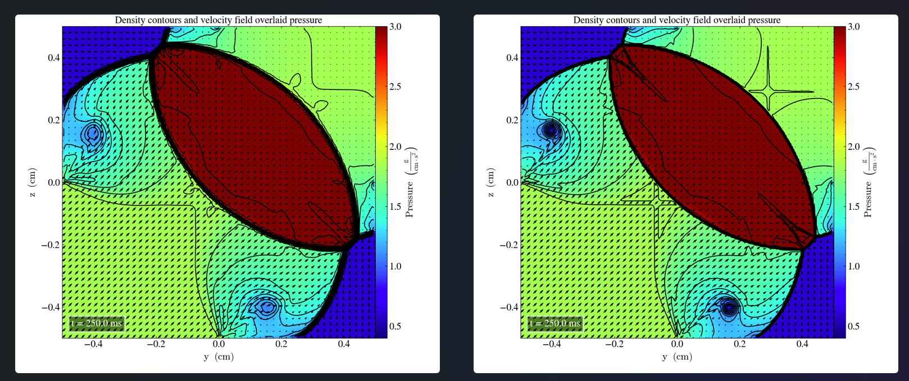
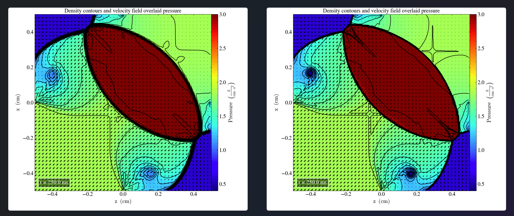

# Liska and Wendroff case 4
Hash 34c177c

We solve the  2D-Riemann problem described in Liska and endroff (2003), case 4 with the following initial parameters:
|       	| $P_l$ 	| $\rho_l$ 	| $v_{x,l}$ 	| $v_{y,l}$ 	| $P_r$ 	| $\rho_r$ 	| $v_{x,r}$ 	| $v_{y,r}$ 	|
|-------	|-------	|----------	|-----------	|-----------	|-------	|----------	|-----------	|-----------	|
| Upper 	| 0.35  	| 0.5065    | 0.8939   	| 0.0       	| 1.1   	| 1.1   	  | 0.0       	| 0.0       	|
| Lower 	| 1.1   	| 1.1     	| 0.8939   	| 0.8939     	| 0.35   	| 0.5065  	| 0.0       	| 0.8939    	|

The results in the xy-plane, at final time t=2.25s are visualized in low (right) and high (left) resolution.

Pressure is displayed by color and density by 29 contours.

We observe that the general shape of the structures is similar to the one in Liska and Wendorff FIG 4.2, with exception to the rounded curves in the upper left and lower right corners. We note differences in both the pressure and density across the domain. We see areas with high density located at approximately (0.2,-0.4) and (-0.4,0.2) which are not present in Liska and Wendorff FIG 4.2. Concerning the pressure, we see that the area with constant pressure is interchanged with the area with varying pressure when compared to Liska and Wendorff.

The process is repeated, using the same initial parameters in the yz-plane, producting the following plots

and the zx-plane

which are both identical to the results in the xy-plane.
