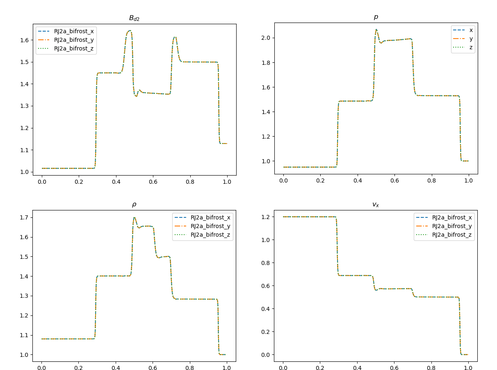
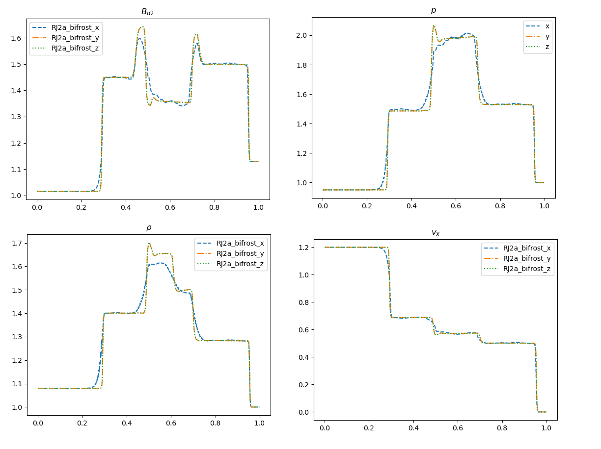
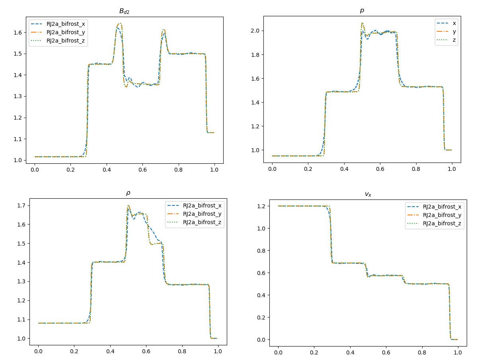
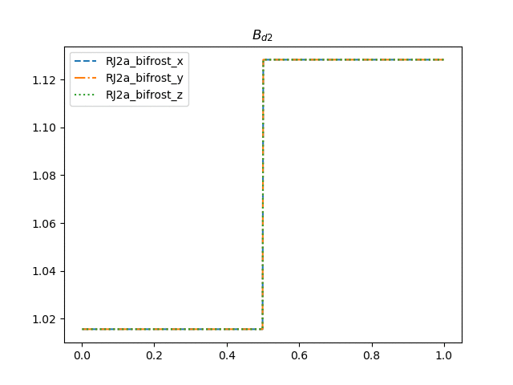
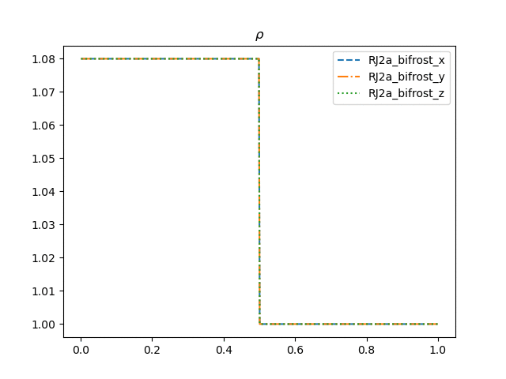

# RJ2a test

Hash: 5278846

For the RJ2a test we use the parameter values from table 5 in F. Miniati et al.(2011) as follows

|$$\rho_L$$|$$v_{x,L}$$|$$v_{x,L}$$|$$P_L$$|$$B_{y,L}$$|$$B_{z,L}$$|$$\rho_R$$|$$P_R$$|$$B_{y,R}$$|$$B_{z,R}$$|$$v_{i,R}$$ |$$\gamma$$|
|----------|-----------|-----------|-------|-----------|-----------|----------|-------|-----------|-----------|--------|----------|
|1.08	   | 1.2       |0.01       | 1.0   | 1.01554   | 0.564189  | 1.0      | 1.0   | 1.128379  | 0.564189  | 0      | 5/3      |

Using the stagger2/bifrost solver with end_time=0.2, timestep=0.01 and default bifrost parameters yields the following plots

Here we see that the plots are quite similar in shape, but somewhat off when it comes to the amplitudes when comparing to F. Miniati et al.(2011).

## Changing parameters

All the bifrost parameters in the x-inputs are then increased, one by one, by a factor of 10.

The variation in `nu1`(Ca),`nu2`(U) and `nu3` yielded subtle changes.

The variation in `nu_d`(d) is illustrated(final snapshot) below

The variation in `nu_ee`(e) is illustrated(final snapshot) below

Finally the variation in `eta3`(E) which yielded the most dramatic changes is illustrated as animations of the magnetics field in the y direction and the density

