
# RJ4d test

* Hash: 177f0c9
* Branch: develepment-bc

### Intial conditions
|$\rho_L$|$v_{x,L}$|$v_{y,L}$|$v_{z,L}$|$P_L$|$B_{y,L}$|$B_{z,L}$|$\rho_R$|$v_{x,R}$|$v_{y,R}$|$v_{z,R}$|$P_R$|$B_{y,R}$|$B_{z,R}$|
|---|---|---|---|---|---|---|---|---|---|---|---|---|---|
|1|0|0|0|1|0|0|0.3|0|0|1|0.2|1|0|

Using the **stagger2/bifrost** solver, with a end time of **t=0.2** and timestep of **0.01** produces the following plots

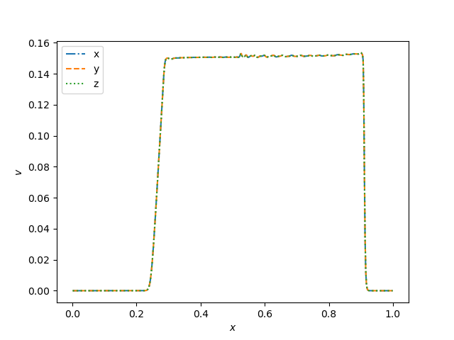
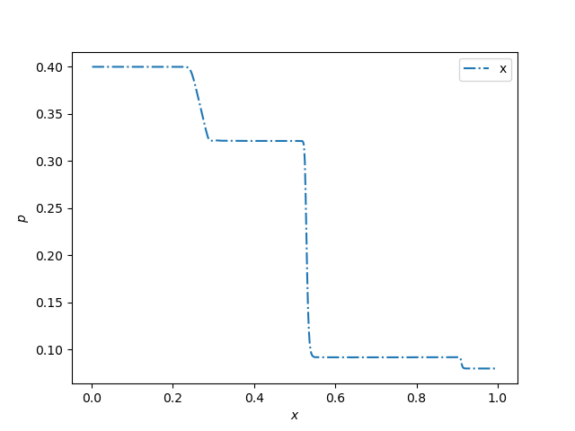
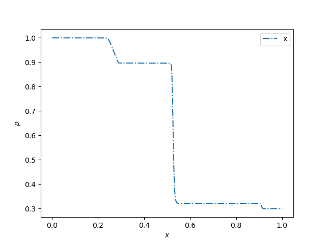

For the **iout=<++>**

The corresponding animations are

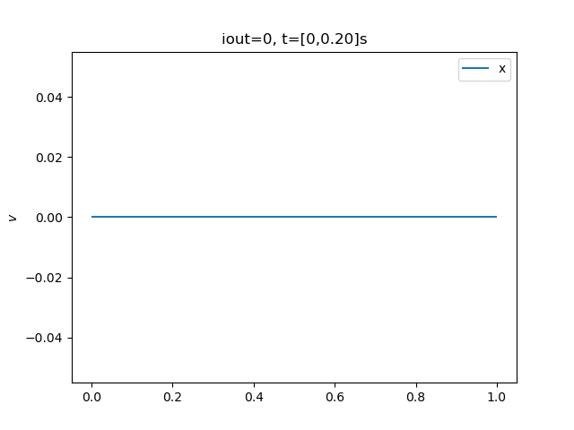
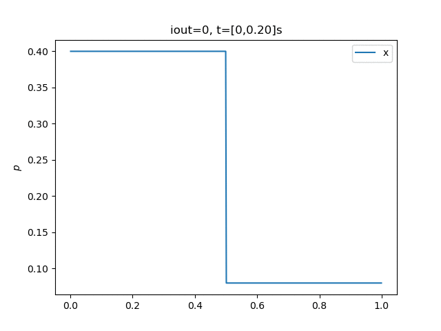
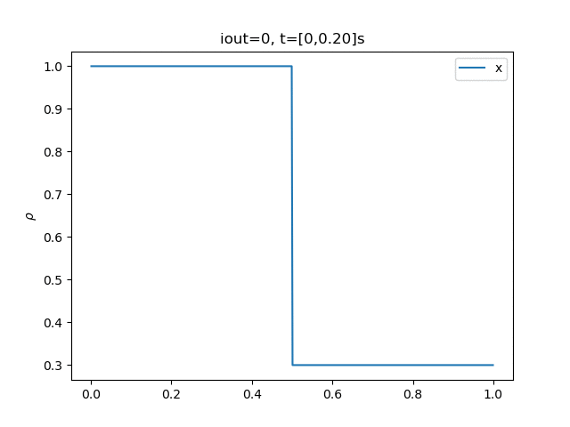

It produces the same in $y$ and $z$ directions, but to save time on the animations I skipped it for now.

### Changes to the conditions

Will start by changing the density on the right side with a factor 100, to see what happens.

At the same time it produces the following

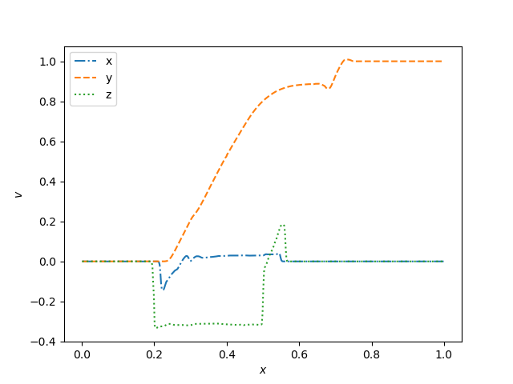
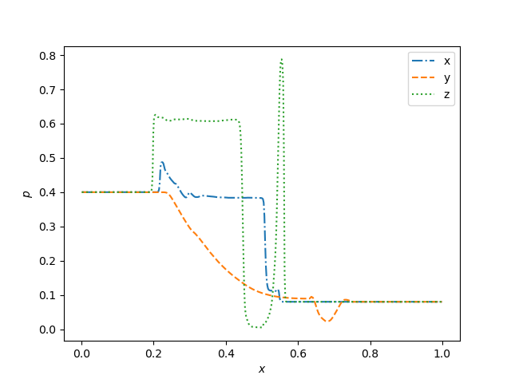
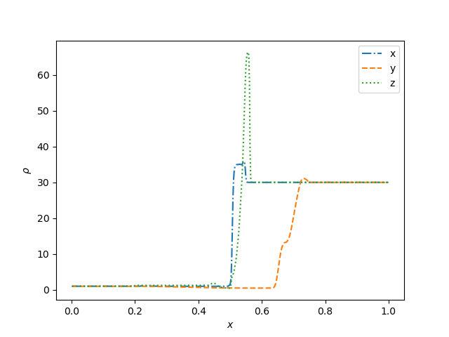

And the following animations
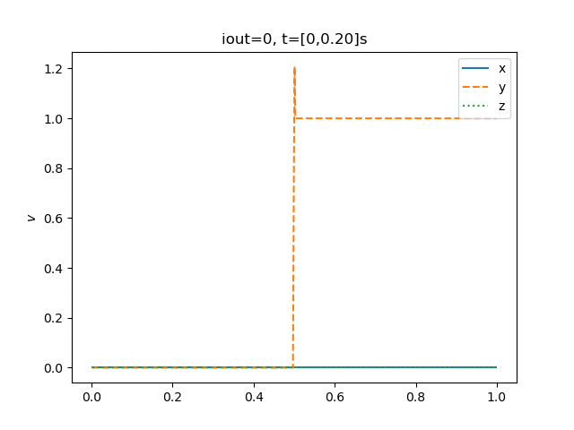
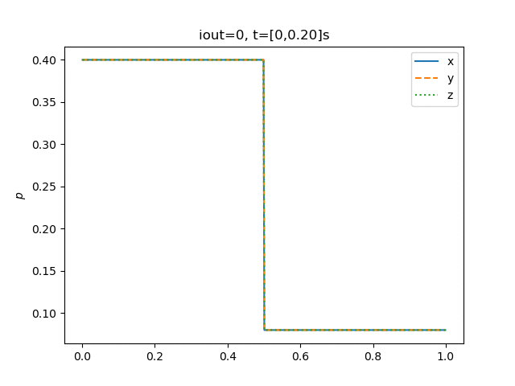
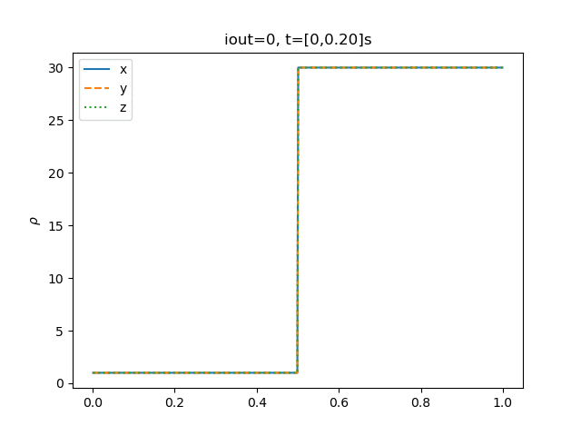
