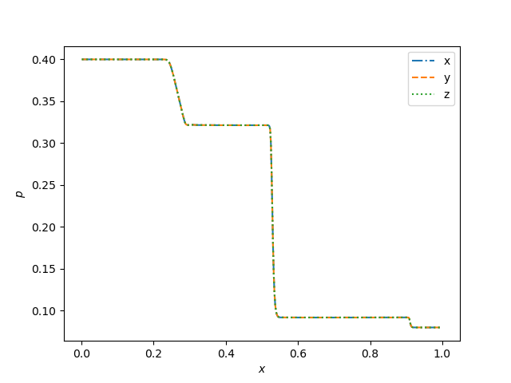
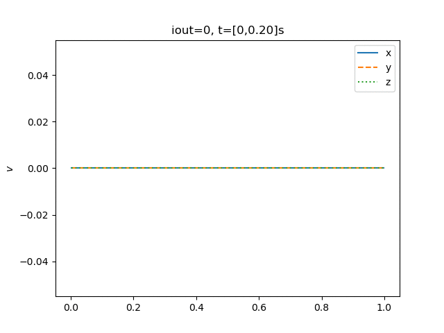
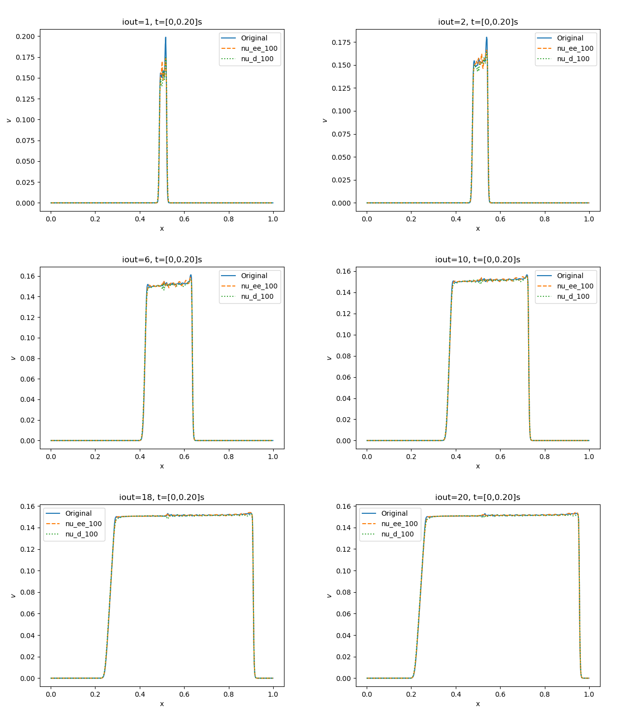
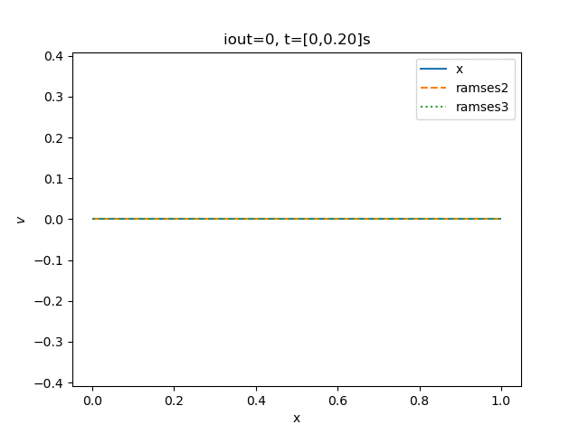

# RJ4d test

* Hash: 177f0c9
* Branch: develepment-bc

## Bifrost
### Intial conditions
|$$\rho_L$$|$$v_{x,L}$$|$$v_{y,L}$$|$$v_{z,L}$$|$$P_L$$|$$B_{y,L}$$|$$B_{z,L}$$|$$\rho_R$$|$$v_{x,R}$$|$$v_{y,R}$$|$$v_{z,R}$$|$$P_R$$|$$B_{y,R}$$|$$B_{z,R}$$|
|---|---|---|---|---|---|---|---|---|---|---|---|---|---|
|1|0|0|0|1|0|0|0.3|0|0|1|0.2|1|0|

Using the **stagger2/bifrost** solver, with a end time of **t=0.2** and timestep of **0.01** produces the following plots

### Intial conditions
Intitial conditions are the same as stated from the before. 
But now using **ramses** solver instead

For the **iout=16**

The corresponding animations are

Comparing them to the [Fig 15](https://iopscience.iop.org/article/10.1086/588755/pdf) (Athena: A new code for astrophysical MHD, Stone et al)

### Changes to the conditions

Will change all the bifrost parameters with a factor of 10. 
Since it is already established that it *should* look identical in all the axis'. 
I will only animate in the $$x$$-axis. 

And the following animations

See from the above animations that the only parameter worth studying closer for the time being is the change in velocity.  

Observe that the parameters stabilize when the time progresses. 
But that for the $$1/10$$ density bifrost parameter, it will be slightly higher values then the original. 

## Ramses

Using the exact same procedure as above. 
But now with the **solver=ramses/hlld** instead. 
Where the original **slope** parameter is **3.5**. 
We get the following

Where we see that the change of slope has very litte effect on the domain. 
Except for the intersection between the left and right. 
But interestingly for a slope parameter of one the simulation crashes after one timestep. 
