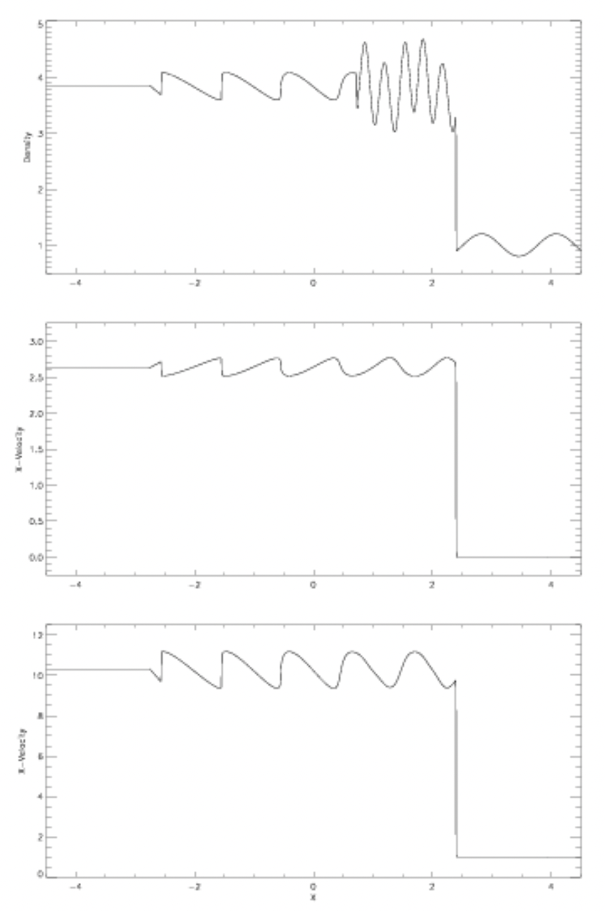
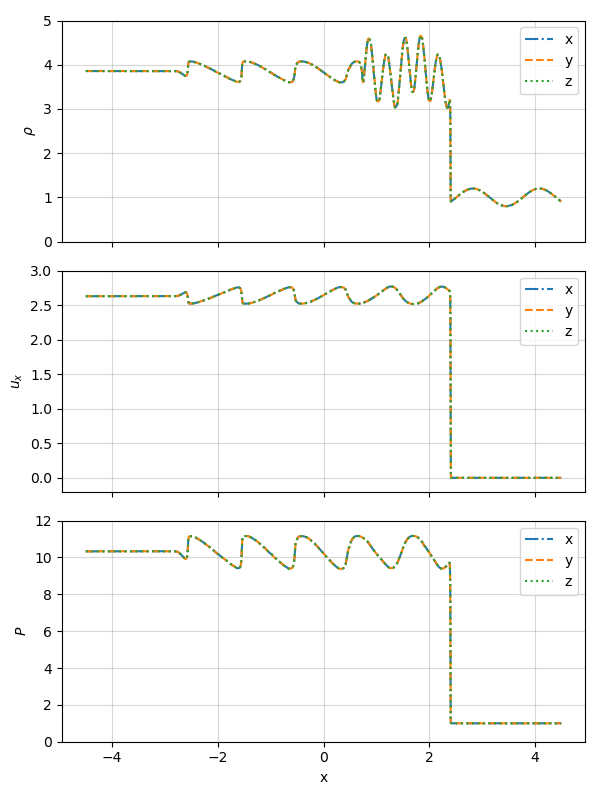
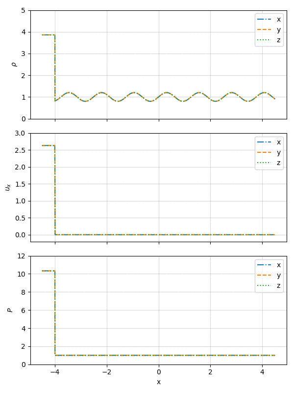
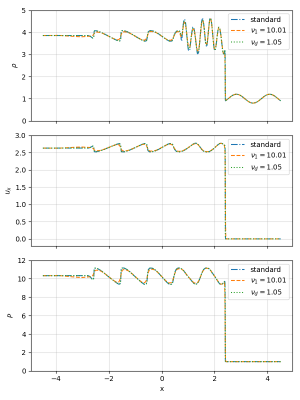
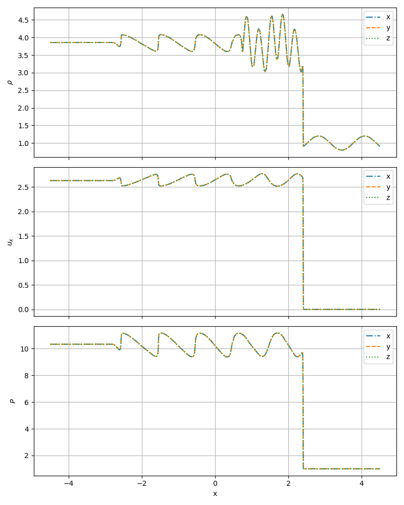
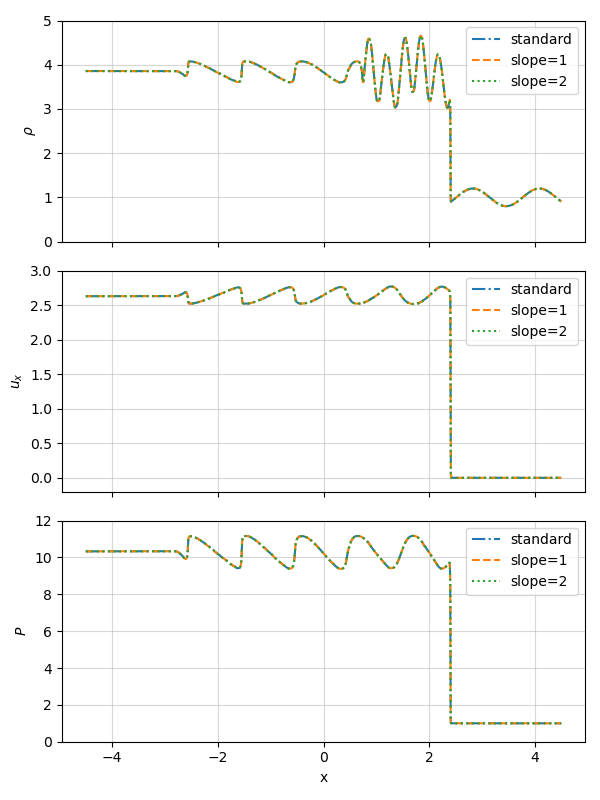

**Current branch:** develop-bc 

**Current commit:** 164f010

# Shu Osher test

We will be comparing our solvers' solutions to the Shu-Osher test with the plots provided by the University of Rochester in their [report on hydrodynamics test problems](https://flash.rochester.edu/site/flashcode/user_support/flash_ug_devel/node184.html#Fig:Shu-Osher_reference_solution). AS a reference, they provided these figures of the density, x-velocity and pressure in the x-direction. 

The Shu-Osher test uses the initial values: 

|            	| $$\rho$$               	| $$v_x$$  	| $$v_y$$ 	| $$v_z$$ 	| $$P$$   	| $$B_x$$ 	| $$B_z$$ 	|
|------------	|------------------------	|----------	|---------	|---------	|---------	|---------	|---------	|
| Left side  	| 3.857143               	| 2.629369 	| 0       	| 0       	| 10.3333 	| ...     	| ...     	|
| Right side 	| $$1+0.2 \sin(5\pi x)$$ 	| 0        	| 0       	| 0       	| 1       	| ...     	| ...     	|

### Bifrost 

Reproducing the test using our Bifrost solver with standard configuration (and simultaneously testing the x-, y- and z-directions) yields the result: 

Here we have used $t = 1.8$ s as the end time of the simulation. We can see that our Bifrost solution of the Shu-Osher test replicates the reference figure very accurately. 

The time evolution of the Shu-Osher test in the x-, y- and z-directions very nicely shows us the shock wave travelling along the x-axis: 

The initial configuration for the Bifrost solver is: 

| Parameter 	| $\nu_1$ 	| $\nu_2$ 	| $\nu_3$ 	| $\nu_d$ 	| $\nu_{ee}$ 	| $\eta_3$ 	|
|-----------	|---------	|---------	|---------	|---------	|------------	|----------	|
| Value     	| 0.01    	| 0.3     	| 0.1     	| 0.05    	| 0.5        	| 0.3      	|

By changing these parameters, we can fine-tune the solution and see if it fits the reference figure even better. 
We begin by changing the parameters such that $\nu_1=10.01$ and $\nu_{ee} = 1.05$, because changing either parameter any less yelds an unnoticable result. The plots are shown below: 

We can see that the curve for $\nu_1 = 10.01$ deviates the most from the reference figure, in which the "turns" on the wavelike shapes are very sharp. By increasing $\nu_1$ a lot, these sharp angles soften out.

### Ramses HLLD solver

We can compare our Bifrost solution with the figure we get when we run the Ramses HLLD solver instead, using the default `slope` parameter set to $3.5$. In the x-, y- and z-directions, this yields: 

Just like we saw with the Bifrost solver, Ramses is also able to reproduce the reference figure very accurately. By changing the `slope` parameter to $1$ and $2$ respectively, we can see if we are able to fine-tune it even further. The results are plotted below: 

It is apparent that changing the `slope` parameter does not change the solution in any noticeable way, at least when we are only looking at the final time step. 

