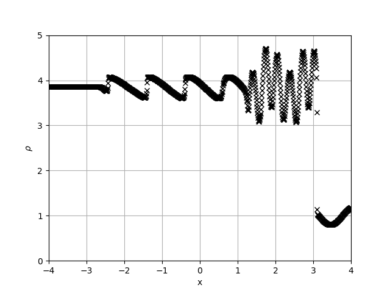

# Shu Osher test

Table of values for Shu-Osher: 

|            	| $$\rho$$               	| $$v_x$$  	| $$v_y$$ 	| $$v_z$$ 	| $$P$$   	| $$B_x$$ 	| $$B_z$$ 	|
|------------	|------------------------	|----------	|---------	|---------	|---------	|---------	|---------	|
| Left side  	| 3.857143               	| 2.629369 	| 0       	| 0       	| 10.3333 	| ...     	| ...     	|
| Right side 	| $$1+0.2 \sin(5\pi x)$$ 	| 0        	| 0       	| 0       	| 1       	| ...     	| ...     	|

Reproducing the test using our Bifrost solver yields the result: 

