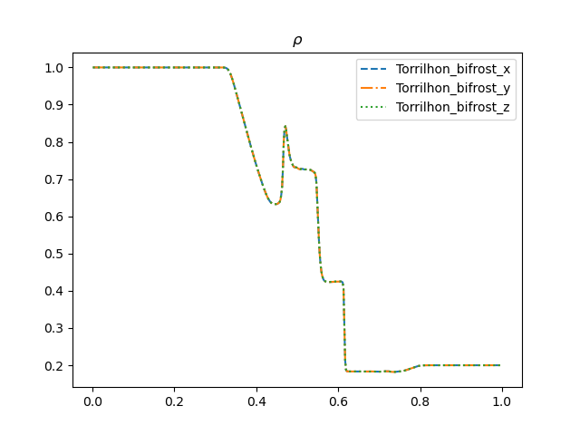
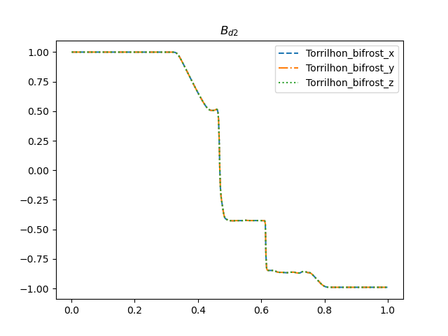
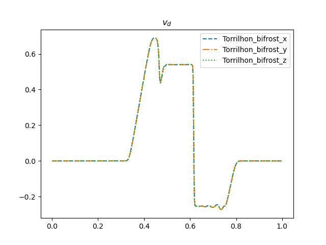

# Torrilhon test

For the Torrilhon (2003) test we use the parameter values from table 2 in James M.Stone et al (2008) as follows

|$$\rho_R$$|$$P_R$$|$$B_{y,R}$$|$$B_{z,R}$$|$$\rho_R$$|$$P_R$$|$$B_{y,R}$$|$$B_{z,R}$$|$$v_i$$ |$$\gamma$$|
|----------|-------|-----------|-----------|----------|-------|-----------|-----------|--------|----------|
|1.0	   | 1.0   | 1.0       | 0         | 0.2      | 0.2   | cos(3)    | sin(3)    | 0      | 1.4      |

Using the stagger2/bifrost solver with end_time=0.1 and timestep=0.01 yields the following plots

Comparing the density plot and the magnetic field plot to Fig. 6 in Torrilhon (2003), we see that the plots are quite similar, with exception of the x-axis being shifted. 
